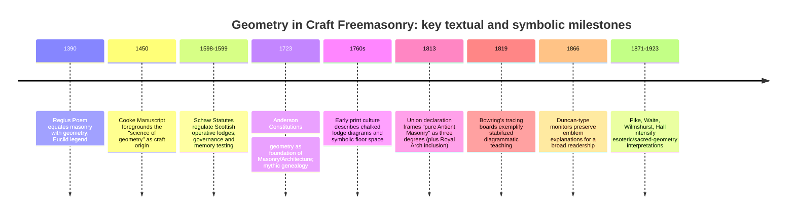

# Geometry in Craft Freemasonry

## Executive summary

Geometry is not a decorative add-on in Craft (Blue Lodge) Freemasonry; it is repeatedly framed as Masonry’s *foundation*, both in early “operative” legacy texts (the medieval “Old Charges”) and in the earliest “speculative” Grand Lodge-era constitutions. The **entity["book","Regius Poem","masonic manuscript c1390"]** explicitly links “the craft of geometry” with “masonry,” and attributes the ordering of the craft to learned clerks and (legendarily) to Euclid. citeturn21view0 The **entity["book","Cooke Manuscript","masonic manuscript c1450"]** opens by promising to explain “the science of geometry,” then narrates a mythic genealogy in which geometry is the root-science from which Masonry proceeds. citeturn21view1 In the early Grand Lodge period, **entity["people","James Anderson","masonic editor 1723"]’s** **entity["book","The Constitutions of the Free-Masons","anderson 1723"] makes geometry the keystone of its origin-story: it asserts that “Geometry” (among the liberal sciences) was “written on the heart of Adam,” and that geometry is the “foundation” of arts, “particularly of Masonry and Architecture.” citeturn20view0

In modern “regular” Craft practice (with jurisdictional variation), geometry appears in three tightly linked ways: (a) **as working tools** (square, compasses, level, plumb, and related implements) used as moral emblems; (b) **as spatial choreography** (measured movement, orientation, and bounded space); and (c) **as instructional diagrams** (tracing boards, floor drawings, the checkered pavement, and Euclid’s 47th proposition). Officially, the **entity["organization","United Grand Lodge of England","grand lodge, london"]** states as a “Basic Principle” for recognition that the “three Great Lights” (Volume of Sacred Law, Square, and Compasses) must be displayed when a lodge is “at work.” citeturn31view0turn31view1 Several Grand Lodge educational explanations (for example, the **entity["organization","Grand Lodge of Ohio","grand lodge, columbus oh"]**) explicitly interpret the square, compasses, level, and plumb as teaching rectitude, restraint, equality, and uprightness—moralized geometry grounded in builder’s practice. citeturn18search0turn18search7

“Esoteric geometry” in a stricter sense—sacred geometry, numerological correspondences, and claims of transmission from ancient mystery schools—exists in (at least) two interpretive layers. First are **mainstream Craft symbolic readings**, often moral and pedagogical, and typically traceable to monitors, lectures, and long-standing lodge instruction. Second are **later occult/esoteric constructions** that read Craft symbols through Hermeticism, Kabbalah, or “ancient mysteries,” often associated with influential non-Craft writers such as **entity["people","Albert Pike","american masonic writer 1871"]**, **entity["people","Arthur Edward Waite","occultist and writer 1911"]**, **entity["people","Walter Leslie Wilmshurst","masonic writer 1922"]**, and **entity["people","Manly P. Hall","occult writer 1923"]. These authors can be important to understanding *what later readers have claimed*, but they are not “official Craft” authorities (and **entity["book","Morals and Dogma","albert pike 1871"]**, for example, is explicitly tied to a Scottish Rite system rather than Blue Lodge instruction). citeturn30search0turn30search4turn30search5turn30search2turn30search7turn30search36

## Scope and method

This report treats “Craft / Blue Lodge Freemasonry” as the three symbolic degrees (Entered Apprentice, Fellow Craft, Master Mason), without assuming a particular jurisdiction, “work,” or printed monitor unless the source is jurisdiction-specific. The **entity["organization","United Grand Lodge of England","grand lodge, london"]** explicitly frames “pure Antient Masonry” as consisting of three degrees (plus inclusion of the Royal Arch in the Union declaration), illustrating why “Craft” is treated as a bounded system even when ritual details differ. citeturn31view0

Because many contemporary rituals are not publicly distributed, “primary ritual” evidence here is drawn from: (a) early constitutions and manuscripts intended for lodge use; (b) published exposures and early printed “monitors” that preserve educational material used historically; and (c) publicly accessible Grand Lodge publications and educational pages. For geometry’s uses and meanings, the analysis triangulates (1) **primary/official** materials, (2) **scholarly historical work**, and (3) **esoteric/occult interpretive literature**, explicitly flagging when a claim is speculative, jurisdiction-local, or contested. citeturn31view0turn21view0turn29view0turn30search36

### Source tiers and credibility model

| Source tier | Typical examples used in this report | What this tier can reliably establish | Typical limitations |
|---|---|---|---|
| Primary (operative/speculative era) | **entity["book","Regius Poem","masonic manuscript c1390"]**, **entity["book","Cooke Manuscript","masonic manuscript c1450"]**, **entity["book","The Constitutions of the Free-Masons","anderson 1723"]**, **entity["book","Schaw Statutes","operative masonry statutes 1598"] | What early texts *said* Masonry/geometry was; what symbols/tools were emphasized in those textual traditions | These texts mix rule-making with legendary history; they show *self-understanding*, not necessarily factual origins (especially mythic genealogies to Adam/Euclid) citeturn21view0turn21view1turn20view0turn13view1 |
| Official Grand Lodge publications | entity["organization","United Grand Lodge of England","grand lodge, london"] Craft Rules / recognition principles; lodge education pages by entity["organization","Grand Lodge of Ohio","grand lodge, columbus oh"] and entity["organization","Grand Lodge of Pennsylvania","grand lodge, harrisburg pa"] | Current “mainstream” Craft framing of symbols as moral instruction; what is required/displayed in lodge | Often descriptive/educational rather than historical-critical; may avoid ritual detail; may reflect one jurisdiction’s emphases citeturn31view0turn31view1turn18search7turn18search13 |
| Scholarly Masonic history | entity["book","The Genesis of Freemasonry","knoop and jones 1947"] (document-based social history framing); entity["book","British Freemasonry, 1717-1813","routledge edition 2016"] (ritual/textual editions) | How practices evolved; how lodges organized; how symbols/diagrams appear in sources; disputes about “operative → speculative” transition | Access and selection constraints; some works are editions of controversial texts and must be contextualized citeturn29view0turn29view2 |
| Esoteric/occult interpretive literature | entity["book","Morals and Dogma","albert pike 1871"], entity["book","The Secret Tradition in Freemasonry","a e waite 1911"], entity["book","The Meaning of Masonry","w l wilmshurst 1922"], entity["book","The Lost Keys of Freemasonry","manly p hall 1923"] | What later esoteric authors *claimed* Craft symbols “really” encode; cross-tradition parallels (Hermetic/Kabbalistic) | Not “official Craft” meanings; frequently speculative; often blends multiple rites/grades and external systems; must be labeled non-mainstream citeturn30search0turn30search5turn30search2turn30search7turn30search36 |

## Geometry in Craft practice and instruction

### Great Lights and the “at work” lodge as a bounded geometric space

At the level of formal requirement (at least in the English “recognition principles” tradition), the lodge “at work” is **defined** by the visible presence of the three “Great Lights”: the Volume of the Sacred Law, the Square, and the Compasses. citeturn31view0turn31view1 This is a foundational point for geometry in Craft because the square and compasses are not merely emblematic—they are required symbols displayed in the working lodge under this recognition model, positioning geometry as part of the lodge’s *operational grammar*. citeturn31view0turn31view1

In practical lodge-room terms, geometry is also embedded in layout: a lodge is commonly oriented East–West; entry is typically described as from the West facing East; and the principal officers are located at fixed stations (Master in the East; Wardens in West and South in many Anglo-American descriptions). A provincial candidate guide explicitly describes this spatial schema and links it to standard lodge-room “furniture,” including the central chequered pavement/carpet and placement of the sacred text with Square and Compasses. citeturn5search5

### Working tools as moralized geometry

A consistent Craft pattern in publicly accessible education material is: **operative tool → geometric function → moral lesson**. For example, educational content issued under the name of the entity["organization","Grand Lodge of Ohio","grand lodge, columbus oh"] presents the square, level, and plumb as the tools of a degree and interprets them as (respectively) rectitude/justice, equality, and uprightness. citeturn18search7 The same Grand Lodge’s explanation of square and compasses ties the square to the builder’s right angle and to being “square” in actions, while the compasses are framed as drawing boundaries—“circumscribing” desires and maintaining moderation. citeturn18search0 A similar “core” moral reading is also taught in other Grand Lodge public education (e.g., the entity["organization","Grand Lodge of Pennsylvania","grand lodge, harrisburg pa"] describes the square as enjoining honesty and fairness and the compasses as self-check and avoidance of overindulgence). citeturn18search13

The key analytical point is that these meanings are not primarily “numerological” or occult: they are *ethical* readings built from the tool’s geometric function (right angle; circle/arc; vertical; horizontal). This makes geometry a didactic bridge between building practice and moral self-construction. citeturn18search0turn18search7turn18search13

### Tracing boards, floor drawings, and diagrammatic teaching

“Tracing boards” (and earlier floor/table drawings) are among the clearest ways geometry becomes instruction. A Routledge scholarly edition of early ritual-related texts (edited by entity["people","Jan A. M. Snoek","masonic historian editor 2016"]) reproduces evidence that lodge space could be *marked out on the floor with chalk*, with symbolic content placed within the bounded area and interpreted afterward. citeturn29view2 In that excerpt, even officer jewels are described geometrically—Master’s jewel as the Square; Senior Warden’s as the Level; Junior Warden’s as the Plumb-Rule—again underscoring that governance roles are symbolized by tools of measurement and rectification. citeturn29view2

For practical examples of tracing boards themselves, an important visual record survives in 19th‑century painted boards preserved through the **entity["point_of_interest","Museum of Freemasonry","freemasons hall, london"]** (accessible via **entity["organization","Art UK","uk art catalog platform"]** and Wikimedia). A complete set by **entity["people","Josiah Bowring","tracing board painter 1819"] (First/Second/Third Degree) illustrates how lodge teaching could be anchored in composed geometric scenes and emblem clusters. citeturn24search0turn24search1turn24search7turn24search8

image_group{"layout":"carousel","aspect_ratio":"16:9","query":["Josiah Bowring First Degree Tracing Board 1819 Museum of Freemasonry","Josiah Bowring Second Degree Tracing Board 1819 Museum of Freemasonry","Josiah Bowring Third Degree Tracing Board 1819 Museum of Freemasonry","John Harris Emulation tracing boards 1849"]}

### Lodge architecture and “tessellated” flooring as lived geometry

A recurring physical feature of lodge rooms is the black-and-white chequered pavement (often linked in lodge discourse to the “mosaic pavement” and to a border described as “tessellated/indented”). A provincial guide describes the lodge carpet/chequered floor as denoting “chequered existence” (happiness and sorrow) and cites a tradition that Solomon’s Temple floor was decorated with a black‑and‑white mosaic. citeturn5search5 An official Grand Lodge resource (“Blue Book”) similarly presents the mosaic pavement as emblematic of human life “checkered with good and evil,” and explicitly pairs it with the border and a central star motif. citeturn23search11

Analytically, this is geometry in at least two senses: (1) literal **tessellation** (repeating squares forming a patterned plane), and (2) symbolic **binary structure** (light/dark; good/evil; joy/sorrow) mapped onto a geometric grid. The link to teaching is strong because the pavement is positioned as the locus of lodge work in many descriptions (the “center” where the altar or key emblems are placed), making geometry a “walked” symbol rather than only a seen diagram. citeturn5search5turn23search11

## Esoteric meanings and later interpretive layers

### Euclid’s 47th proposition as “proof,” foundation, and emblem

In mainstream Craft educational framing, “Euclid’s 47th Problem” (the Pythagorean theorem) functions as a symbol of (a) demonstrable truth, (b) the usefulness of geometry to builders, and (c) the aspiration to be “lovers of the arts and sciences.” The entity["organization","Grand Lodge of Ohio","grand lodge, columbus oh"] summarizes the proposition as a geometric truth about right triangles and presents it as a Masonic emblem. citeturn25search3

Historically, older Masonic writings embed the proposition in a legendary frame. In entity["people","William Preston","masonic author 1796"]’s **entity["book","Illustrations of Masonry","william preston 1796"], the 47th proposition is linked to **entity["people","Pythagoras","greek philosopher c570bc"] (including the “Eureka”/hecatomb legend and a claim of discovery). citeturn7view2 A closely related formulation appears in 19th‑century monitors/exposures, where the proposition is presented as teaching Masons to be “general lovers of the arts and sciences.” citeturn10search32turn10search24

A modern UGLE provincial education paper on the Past Master’s jewel makes an important corrective distinction: some historically repeated elements (e.g., Pythagoras as a Mason; “Eureka” and the hecatomb) are best treated as “apocryphal legend,” not history; and it also notes technical complexities (the diagram used in jewelry may correspond to the 48th proposition as proof rather than the 47th as statement). citeturn26view1

### The Past Master’s jewel as applied geometry

In English Craft practice, a widely used Past Master’s jewel places the diagram of Euclid’s 47th proposition within or pendent from a square, explicitly turning a geometric proof into a badge of office and responsibility. A provincial UGLE paper states that use of the 47th proposition in Masonic symbolism is evidenced at least in the 18th century, and that codification of a Past Master’s jewel including a square and the diagram appears in relation to the first Book of Constitutions of the United Grand Lodge of England (1815). citeturn26view1 In this reading, the Past Master’s emblem is not merely mathematical; it reflects the duty to “prove” standards and preserve moral/ritual correctness in lodge governance—geometry as ethical verification. citeturn26view1

### The point within a circle and bounded conduct

The “point within a circle” is a salient case for distinguishing “mainstream Craft” from “later occult” interpretations. In a mainstream educational explanation issued by the entity["organization","Grand Lodge of Ohio","grand lodge, columbus oh"], the symbol is linked to boundaries of conduct and is also related (as one interpretation) to the candidate’s circumambulation about the altar, with brethren forming parallel lines. citeturn22search2 This reading is consistent with the broader Craft habit of mapping ethical restraint onto geometric boundary, and ritual movement onto bounded space. citeturn22search2

By contrast, classical esoteric authors sometimes read the point-within-circle as a sexual or generative glyph and as a key to ancient mystery symbolism. For instance, entity["people","Albert G. Mackey","masonic author 1869"]’s **entity["book","The Symbolism of Freemasonry","albert g mackey 1869"] connects the point-within-circle to ancient mystery traditions in a way that goes well beyond the moral “bounded passions” lesson. citeturn22search16turn10search26 This is influential in later Masonic symbolism literature, but it should be flagged as interpretive and not a universal Craft “official” meaning. citeturn22search16turn10search26

### Pillars and duality

The twin pillars (traditionally named “Jachin” and “Boaz” in many Masonic contexts) are strongly present on tracing boards and in ritual narrative, and their meaning is often expressed in dual terms (strength/establishment; stability). In early printed ritual-related literature, the presence of a chalk-marked space with two columns, and prominent letters corresponding to those pillars, appears as part of the diagrammatic lodge. citeturn29view2

Scholarly work on this motif also highlights a historical development: as Freemasonry and its print culture expanded, specific biblical figures and architectural images became increasingly elaborated in constitutions, handbooks, and diagrammatic lodge representations. A peer‑reviewed academic chapter hosted by Brill analyses the evolution of “Jachin and Boaz” from relatively plain columns into more complex symbolic and printed elements in the developing Masonic economy of texts and images. citeturn22search3

### Sacred geometry and numerology as non-mainstream overlays

Modern language such as “sacred geometry” and extended numerological coding (e.g., treating lodge numbers, steps, and figures as esoteric keys to cosmic structure) is most characteristic of later interpretive schools rather than early Craft didacticism. Esoteric writers often read Craft symbols as fragments of a wider perennial system—sometimes explicitly Hermetic, sometimes Kabbalistic, sometimes “mystery school” oriented. Examples include:

- **entity["book","Morals and Dogma","albert pike 1871"]** by entity["people","Albert Pike","american masonic writer 1871"] (explicitly Scottish Rite–focused; influential in esoteric readings that connect Masonic symbolism with ancient mysteries and Kabbalah). citeturn30search0turn30search4turn30search36  
- **entity["book","The Secret Tradition in Freemasonry","a e waite 1911"] by entity["people","Arthur Edward Waite","occultist and writer 1911"] (frames “Craft symbolism” in relation to a “secret tradition” and higher-grade developments). citeturn30search5turn30search29turn30search33  
- **entity["book","The Meaning of Masonry","w l wilmshurst 1922"] by entity["people","Walter Leslie Wilmshurst","masonic writer 1922"] (presents Masonry as a system of inner moral/spiritual initiation and “deeper symbolism”). citeturn30search2turn30search18turn30search6  
- **entity["book","The Lost Keys of Freemasonry","manly p hall 1923"] by entity["people","Manly P. Hall","occult writer 1923"] (explicitly occult framing; reads Masonry as a mystery school and situates symbols in broader esoteric history). citeturn30search7turn30search3turn30search35  

These readings are historically important but should be treated as **non-mainstream** relative to what Grand Lodges typically publish for Craft candidates, and as often synthesizing multiple rites/grades rather than restricting themselves strictly to Blue Lodge pedagogy. citeturn30search36turn31view1

image_group{"layout":"carousel","aspect_ratio":"16:9","query":["Euclid 47th proposition Masonic symbol diagram","Past Master jewel 47th proposition of Euclid","point within a circle Freemasonry symbol","Masonic mosaic pavement checkered floor lodge"]}

### Comparative table of symbols, claims, and interpretive reliability

| Geometric emblem or figure | Observable Craft use (what it *does* in lodge practice) | Mainstream Craft interpretive center | Later esoteric/occult overlay (flagged) | Reliability notes (high/medium/low) |
|---|---|---|---|---|
| Square and Compasses | Displayed as core emblem; treated as “Great Lights” in some recognition models citeturn31view0turn31view1 | Square = rectitude; compasses = circumscribed desires/self-restraint citeturn18search0turn18search13 | Sometimes read as cosmic dual principles / generative symbolism (varies by author) citeturn22search16 | High for “moral tool” reading (official GL education); low–medium for sexual/cosmic overlays |
| Square / Level / Plumb | Tools and officer-jewel symbolism; used to teach degree lessons citeturn29view2turn18search7 | Square = justice; level = equality; plumb = uprightness citeturn18search7 | Sometimes mapped to metaphysical “planes” or subtle bodies (non-universal) citeturn30search2 | High for basic moral meanings; low for metaphysical specifics unless jurisdictionally documented |
| 47th Proposition | Appears in lectures/monitors; used as emblem; appears on Past Master jewel in some systems citeturn25search3turn26view1 | Demonstrable truth; builder’s right angle; “lover of arts & sciences” citeturn25search3turn10search32 | Sometimes treated as “key” to hidden cosmic structure and ancient mysteries citeturn30search4turn30search7 | High for geometric truth and emblem use; medium for “foundation of all Masonry” as rhetoric; low for ancient-mystery claims |
| Point within a circle | Used as symbolic diagram; interpreted in relation to circumscribed conduct and circumambulation citeturn22search2 | Boundaries of behavior; locus of moral restraint; ritual movement within bounds citeturn22search2 | Treated by some as ancient generative glyph linked to mysteries citeturn22search16 | High for ethical-boundary reading; low–medium for mystery/sexual symbolism depending on author |
| Mosaic / checkered pavement (tessellation) | Physical lodge-room feature; “flooring” on which work occurs; paired with border/star motifs citeturn23search11turn5search5 | Duality of human life (good/evil; joy/sorrow) citeturn23search11turn5search5 | Extended duality metaphysics (yin/yang analogies; initiatory thresholds) common in esoteric writing citeturn30search2 | High for “chequered existence” pedagogy; medium–low for specific ancient attributions (Temple floor claims often traditional rather than evidenced) |
| Twin pillars | Visible on tracing boards; ritual narrative; “between pillars” as threshold imagery citeturn29view2turn22search3 | Duality/stability; strength/establishment (varies by lecture tradition) citeturn22search3 | Kabbalistic “pillars” of mercy/severity; alchemical gates; etc. common in occult synthesis citeturn30search5turn30search4 | Medium–high for presence and basic dual reading; low for precise Kabbalistic mappings unless explicitly taught in a given system |

## Historical development

### From “operative” geometry to “speculative” moral geometry

Medieval and early modern masonry regulations and legends repeatedly identify geometry as Masonry’s core science. The **entity["book","Regius Poem","masonic manuscript c1390"]** equates Masonry with “the craft of geometry” and explicitly names “Euclid” as a founding figure in its legendary history. citeturn21view0 The **entity["book","Cooke Manuscript","masonic manuscript c1450"] frames itself as an account of how the “science of geometry” began, functioning as a proto‑charter narrative for craft identity. citeturn21view1 These manuscripts are not neutral histories; they are normative and legitimizing texts (“Old Charges”) that use geometry to sacralize and intellectualize the craft. citeturn21view0turn21view1

In the Scottish operative context, the **entity["book","Schaw Statutes","operative masonry statutes 1598"] (1598/1599) show highly organized lodge governance (wardens, deacons, records, apprenticeship rules), indicating that “lodges” existed as institutions before 1717. citeturn13view1 Commentary within the same document also highlights an intriguing cultural bridge: the second statutes’ reference to testing fellows in “the art of memory” has been interpreted as potentially aligning with Renaissance intellectual currents, though the historical meaning of that phrase remains debated. citeturn13view1

In the early speculative Grand Lodge era, **entity["people","James Anderson","masonic editor 1723"]’s** **entity["book","The Constitutions of the Free-Masons","anderson 1723"] reasserts geometry as the intellectual foundation—explicitly naming geometry the basis of Masonry and Architecture and embedding it into a universal myth-history beginning with Adam. citeturn20view0 This is a key pivot: geometry becomes not only trade knowledge but also a universalized philosophical principle that legitimates social, moral, and institutional Masonry. citeturn20view0

Scholarly Masonic history has treated the operative-to-speculative transition as a document-based problem in social history rather than as a timeless esoteric continuity. **entity["people","Douglas Knoop","economic historian 1947"] and **entity["people","G. P. Jones","economic historian 1947"] explicitly frame Masonic history as “a branch of social history,” to be investigated like other institutions, and position their work as revising earlier narratives through evidence and source criticism. citeturn29view0

### Diagrammatic lodge space and the rise of tracing boards

By the mid‑18th century, published ritual-related texts depict the lodge as a diagrammatic space: a marked-out floor area, with symbols and letters drawn and later interpreted. In the Routledge material edited by entity["people","Jan A. M. Snoek","masonic historian editor 2016"], the candidate is described as being led around a chalk-marked space; letters corresponding to key pillar-symbols are drawn; and geometric officer jewels are enumerated. citeturn29view2 This provides a clear lineage from “drawn lodge” to “tracing board” as a durable teaching device. citeturn29view2

In the 19th century, painted tracing boards (such as those by **entity["people","Josiah Bowring","tracing board painter 1819"] preserved through the **entity["point_of_interest","Museum of Freemasonry","freemasons hall, london"]**) show the consolidation of symbolic geometry into stable iconographic programs—effectively “curriculum plates” for the degrees. citeturn24search0turn24search1turn24search7turn24search8

### Mermaid timeline of major developments

The following timeline is a *synthetic* visualization of milestones supported by the sources cited in this report.

Supporting sources for these milestones include the **entity["book","Regius Poem","masonic manuscript c1390"],** **entity["book","Cooke Manuscript","masonic manuscript c1450"],** **entity["book","Schaw Statutes","operative masonry statutes 1598"],** the 1723 Constitutions, the UGLE union declaration embedded in current Craft rules, the Routledge ritual editions, and the Bowring tracing boards via Art UK/Museum of Freemasonry. citeturn21view0turn21view1turn13view1turn20view0turn31view0turn29view2turn24search7turn24search8

## Comparative notes

### Medieval guild knowledge and the liberal arts frame

The medieval Masonic “Old Charges” locate Masonry within the Seven Liberal Arts tradition, with geometry treated as the decisive science for builders. This is explicit in both the **entity["book","Regius Poem","masonic manuscript c1390"]** and **entity["book","Cooke Manuscript","masonic manuscript c1450"], which narrate geometry as learned, transmissible, and socially valuable (a means to provide “honest” livelihood and order). citeturn21view0turn21view1 This parallels broader medieval educational hierarchies in which geometry was central to measuring land, configuring buildings, and conceptualizing proportion. (The key point is the *status* of geometry as “science,” not necessarily a claim of direct continuity from a specific medieval guild to a modern Grand Lodge.) citeturn21view0turn29view0

### Renaissance intellectual currents and “memory” practices

The **entity["book","Schaw Statutes","operative masonry statutes 1598"]** contain a notable instruction that craft fellows and apprentices should be tested in “the art of memory,” which some commentators have associated with Renaissance “art of memory” techniques and esoteric intellectual culture, though the precise implication for operative Masonry is contested. citeturn13view1 In comparative terms, this shows how lodge culture could intersect with broader early modern intellectual practices without requiring the strong claim that Masonry was itself an esoteric school in the Renaissance sense. citeturn13view1turn29view0

### Kabbalah, Hermeticism, and sacred geometry as later interpretive grafts

Kabbalistic or Hermetic mappings (e.g., reading lodge pillars as “severity/mercy” columns or interpreting geometric emblems as alchemical diagrams) are best understood historically as **interpretive overlays** developed in later esoteric literature and in some higher-degree systems, not as universally standardized Craft meanings. citeturn30search4turn30search5turn30search36 The scholarly evaluation of entity["people","Albert Pike","american masonic writer 1871"]’s influence underscores that his work became famous and contentious partly because it systematized wide-ranging esoteric references that many readers then projected back onto Masonry as a whole. citeturn30search36

## Reliability assessment and contested claims

### What is well supported

It is strongly supported (by multiple primary and official sources) that Craft Masonry has long emphasized geometry as foundational language and metaphor: medieval Old Charges equate Masonry with geometry; Anderson’s 1723 Constitutions make geometry the foundation of Masonry and architecture; and modern regularity principles require visible geometric emblems (square and compasses) in working lodges. citeturn21view0turn20view0turn31view0turn31view1 It is also well supported that geometric tools are used symbolically for moral instruction in modern Grand Lodge educational material. citeturn18search0turn18search7turn18search13

### What is weakly supported or rhetorical

Claims that (for example) **entity["people","Pythagoras","greek philosopher c570bc"]** was a “Master Mason” or that he literally shouted “Eureka” and sacrificed a hecatomb *as part of a Masonic discovery narrative* are best treated as traditional rhetorical legend preserved in monitors and lectures, not as historical fact. citeturn7view2turn10search32turn26view1 Similarly, claims that Solomon’s Temple floor was literally a black‑and‑white checkered mosaic are often presented as “Masonic tradition” and used symbolically; they are not strongly evidenced as architectural history within the cited candidate guidance (which frames it as tradition). citeturn5search5turn23search11

### What is non-mainstream and must be labeled as such

Interpretations that treat Craft emblems as direct survivals of Egyptian mysteries, alchemical initiations, or encoded Kabbalistic diagrams are significant *as esoteric literature* but are not grounded in official Craft rule texts and are not universal across jurisdictions. Their credibility depends on whether the claim is historical (generally weak) or interpretive/philosophical (often coherent but not “official”). citeturn30search0turn30search5turn30search7turn30search36turn29view0

### Contested-claim matrix

| Claim | Best-supported reading | Sources supporting the best-supported reading | Status of stronger versions of the claim |
|---|---|---|---|
| “Geometry is the foundation of Masonry.” | A longstanding *internal* Masonic claim that geometry grounds both operative building and speculative moral order | Regius/Cooke as early craft identity texts; Anderson 1723; modern UGLE recognition principles citeturn21view0turn21view1turn20view0turn31view1 | If taken as “objective historical origin from creation,” it becomes mythic rhetoric rather than factual history (Anderson’s Adam narrative is explicitly legendary-style) citeturn20view0turn29view0 |
| “47th Proposition is central to Craft.” | Widely used as emblem; appears in monitors/lectures; historically associated with Past Master jewel in some systems | GL Ohio educational page; Preston/Duncan-type formulations; UGLE-provincial Past Master jewel paper citeturn25search3turn7view2turn10search32turn26view1 | Claims that it is “foundation of all Masonry, sacred/civil/military” may function as rhetorical amplification; the Pythagoras-as-Mason story is treated as apocryphal by modern educators citeturn26view1 |
| “Tracing boards descend from chalked floor lodges.” | Strong documentary evidence of chalk-marked lodge diagrams in early texts and later movement to durable boards | Routledge edition excerpt describing chalked space and symbols; Museum of Freemasonry boards as later durable exemplars citeturn29view2turn24search7turn24search8 | Claims of a single unbroken, standardized design from the medieval period are not supported by these sources; the evidence points to evolution and variation citeturn29view0turn29view2 |
| “Point-within-circle is primarily an occult generative glyph.” | In mainstream GL education it is primarily ethical boundary + ritual movement interpretation | GL Ohio explanation citeturn22search2 | Occult/generative readings exist (e.g., Mackey-style claims) but are interpretive overlays, not universal Craft instruction citeturn22search16turn10search26 |
| “Freemasonry is directly derived from ancient mystery schools via sacred geometry.” | Freemasonry uses ancient references and allegory; historical origins are better treated through documentary social history | Knoop & Jones’ methodological framing; academic evaluation of Pike’s role in later esoteric projection citeturn29view0turn30search36 | Strong “direct descent” claims are typically non-academic and should be treated as speculative unless supported by document chains (not supplied by the cited esoteric works) citeturn30search7turn30search5turn29view0 |

## References

Primary and official Craft sources (publicly accessible)

- **entity["organization","United Grand Lodge of England","grand lodge, london"]**, *Book of Constitutions / Craft Rules* (includes “Basic Principles for Grand Lodge Recognition,” and the requirement that the three Great Lights be exhibited). citeturn31view0  
- **entity["organization","United Grand Lodge of England","grand lodge, london"]**, *Information Booklet* (public summary including recognition principles and Great Lights statement). citeturn31view1  
- **entity["book","The Constitutions of the Free-Masons","anderson 1723"]** (facsimile PDF; contains the “Geometry written on the heart of Adam” passage and geometry-as-foundation language). citeturn20view0  
- **entity["book","Regius Poem","masonic manuscript c1390"]** (translation/transcription emphasizing “geometry” and Masonry). citeturn21view0  
- **entity["book","Cooke Manuscript","masonic manuscript c1450"]** (translation/transcription foregrounding the “science of geometry”). citeturn21view1  
- **entity["book","Schaw Statutes","operative masonry statutes 1598"]** (operative regulations; includes discussion of lodge governance and the “art of memory” phrase). citeturn13view1  
- Provincial/Grand Lodge educational guidance on lodge-room layout and pavement symbolism (candidate guide and “Blue Book” excerpts). citeturn5search5turn23search11  
- **entity["organization","Grand Lodge of Ohio","grand lodge, columbus oh"]**, “Behind the Masonic Symbols” and “Working Tools” educational pages (square/compasses; square/level/plumb; point within circle; Euclid’s 47th). citeturn18search0turn18search7turn22search2turn25search3  
- **entity["organization","Grand Lodge of Pennsylvania","grand lodge, harrisburg pa"]**, public educational page on the square and compasses (core moral meaning). citeturn18search13  
- UGLE provincial educational paper on the Past Master’s jewel and Euclid’s proposition. citeturn26view1  

Tracing boards and visual exemplars

- **entity["people","Josiah Bowring","tracing board painter 1819"]**, First/Second/Third Degree tracing boards (via **entity["point_of_interest","Museum of Freemasonry","freemasons hall, london"]** and **entity["organization","Art UK","uk art catalog platform"]**). citeturn24search7turn24search8turn24search0turn24search1  

Secondary scholarship and academic framing

- **entity["book","The Genesis of Freemasonry","knoop and jones 1947"]** by entity["people","Douglas Knoop","economic historian 1947"] and entity["people","G. P. Jones","economic historian 1947"] (methodological framing of Masonic history as social history; document-based approach). citeturn29view0  
- **entity["book","British Freemasonry, 1717-1813","routledge edition 2016"] edited by entity["people","Jan A. M. Snoek","masonic historian editor 2016"] (evidence for chalked lodge space and officer jewels as square/level/plumb rule in early textual tradition). citeturn29view2  
- Brill academic chapter on the historical development of “Jachin and Boaz” symbolism in Masonic print and practice. citeturn22search3  

Esoteric/occult sources (influential but non-mainstream for Craft interpretation)

- **entity["book","Morals and Dogma","albert pike 1871"] by entity["people","Albert Pike","american masonic writer 1871"] (Scottish Rite focus; influential esoteric synthesis). citeturn30search0turn30search4turn30search36  
- **entity["book","The Secret Tradition in Freemasonry","a e waite 1911"] by entity["people","Arthur Edward Waite","occultist and writer 1911"] (esoteric framing of Craft symbolism and higher grades). citeturn30search5turn30search29turn30search33  
- **entity["book","The Meaning of Masonry","w l wilmshurst 1922"] by entity["people","Walter Leslie Wilmshurst","masonic writer 1922"] (inner/initiatic reading of Craft symbolism). citeturn30search2turn30search18turn30search6  
- **entity["book","The Lost Keys of Freemasonry","manly p hall 1923"] by entity["people","Manly P. Hall","occult writer 1923"] (explicit occult “mystery school” re-reading of Masonic symbols). citeturn30search7turn30search35turn30search3  
- **entity["book","The Symbolism of Freemasonry","albert g mackey 1869"] by entity["people","Albert G. Mackey","masonic author 1869"] (major 19th‑century symbolic synthesis; includes nontrivial “mystery tradition” claims). citeturn10search26turn22search16